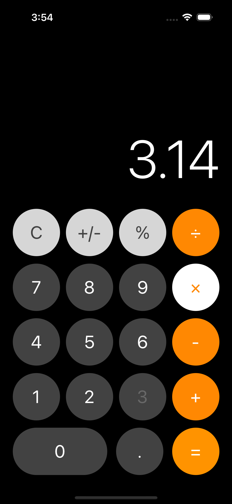

# iOS Calculator
Customizable calculator for iOS and watchOS. The aim of the project is to learn more about how mobile, and more specifically iOS, programming. The app was developed during January 2018 and has not been updated since February 2018.

## Design and Functionality
The initial design is heavily inspired by the standard iOS Calculator.app. The app uses the iPhone's Haptic Engine, has support for Dark Mode and has copy/paste functionality. A big emphasis on the app design has been on allowing the UI elements to scale dynamically to different screen sizes.



## Code

The application is entirely built using The Swift Programming Language.

The main UI component is placed in the Swift file ```ViewController.swift```. The class for the button shape is located in ```roundButtons.swift```.

Each type of button has it's own custom handler that inherits from the class ```ButtonHandler```in the file ```buttonHandler.swift```. The handlers are located in the ```/Handlers``` directory.

The Swift file ```copyableLabel.swift``` adds paste and copy functionlity to the application.

## Roadmap

A roadmap for future functionality and bug fixes is located in the "Issues" section in the GitHub Repository.